<!--
  Todo el pixel art de este perfil se genera con `python3 art/build.py`.
  Los SVG llevan versión clara y oscura: <picture> elige según tu tema de GitHub.
-->

<picture>
  <source media="(prefers-color-scheme: dark)" srcset="assets/hero-dark.svg">
  
</picture>

  

  <a href="https://trece.ar" target="_blank"><picture><source media="(prefers-color-scheme: dark)" srcset="assets/btn-web-dark.svg"></picture></a>
  <a href="https://linkedin.com/in/gushh" target="_blank"><picture><source media="(prefers-color-scheme: dark)" srcset="assets/btn-linkedin-dark.svg"></picture></a>
  <a href="https://calendly.com/gushhio/30min" target="_blank"><picture><source media="(prefers-color-scheme: dark)" srcset="assets/btn-calendly-dark.svg"></picture></a>

 

<picture>
  <source media="(prefers-color-scheme: dark)" srcset="assets/title-camino-dark.svg">
  
</picture>

<picture>
  <source media="(prefers-color-scheme: dark)" srcset="assets/camino-dark.svg">
  
</picture>

<table>
  <tr>
    <td width="33%" valign="top">
      <b>1 · 💡 Idea</b> 
      Contame qué querés construir: un producto, una plataforma, una herramienta para tu equipo. No hace falta que sea técnica: si vos la entendés, alcanza.
    </td>
    <td width="33%" valign="top">
      <b>2 · 📜 Presupuesto</b> 
      Analizo tu idea, te hago las preguntas que hagan falta y te envío un presupuesto claro, con alcance y etapas.
    </td>
    <td width="33%" valign="top">
      <b>3 · 🚀 Concreción</b> 
      Diseño la arquitectura, desarrollo y lanzamos. Tu idea funcionando y lista para crecer.
    </td>
  </tr>
</table>

  <b>¿Tenés una idea dando vueltas?</b> &nbsp;<a href="mailto:gus@trece.ar?subject=Tengo%20una%20idea%20%F0%9F%92%A1&body=%C2%A1Hola%20Gus%21%0A%0A%F0%9F%92%A1%20Mi%20idea%3A%0A%0A%0A%F0%9F%91%A5%20%C2%BFPara%20qui%C3%A9n%20es%3F%0A%0A%0A%F0%9F%93%85%20%C2%BFPara%20cu%C3%A1ndo%20me%20gustar%C3%ADa%20tenerla%3F%0A%0A%0A%F0%9F%93%8E%20Algo%20m%C3%A1s%20que%20tengas%20que%20saber%3A%0A%0A">💡 Contámela por email →</a>

 

<picture>
  <source media="(prefers-color-scheme: dark)" srcset="assets/title-logros-dark.svg">
  
</picture>

Más de 10 años convirtiendo ideas en software. Algunos logros del camino:

<picture>
  <source media="(prefers-color-scheme: dark)" srcset="assets/logro-liderazgo-dark.svg">
  
</picture>

> Lideré equipos de desarrollo backend, implementando metodologías de trabajo estructuradas con *pull requests*, *code reviews* y buenas prácticas en Laravel.

<picture>
  <source media="(prefers-color-scheme: dark)" srcset="assets/logro-arquitectura-dark.svg">
  
</picture>

> Diseñé la arquitectura y migración completa del portal de *Clasificados La Voz de Córdoba* (de Drupal a Laravel). Implementé arquitecturas basadas en DDD con Laravel y Doctrine para plataformas fintech.

<picture>
  <source media="(prefers-color-scheme: dark)" srcset="assets/logro-impacto-dark.svg">
  
</picture>

> Desarrollé soluciones PHP en Symfony para clientes de gran escala como **PayPal, Bimbo, Virgin y Renault**.

 

<picture>
  <source media="(prefers-color-scheme: dark)" srcset="assets/title-sobre-mi-dark.svg">
  
</picture>

<picture>
  <source media="(prefers-color-scheme: dark)" srcset="assets/profile-dark.svg">
  
</picture>

Soy **Gus**, desarrollador **PHP especializado en Laravel** con más de 10 años de trayectoria convirtiendo ideas en software escalable y robusto. Mi carrera se centró en el diseño de arquitecturas de sistemas, el liderazgo técnico de equipos y la optimización del rendimiento: justo lo que necesita una idea para convertirse en un producto que funcione y crezca.

Me apasiona resolver problemas complejos. Trabajo con clientes de toda Latinoamérica y el proceso es simple: me contás tu idea, te envío un presupuesto y la hacemos realidad.

<table>
  <tr>
    <td align="center" width="33%" valign="top">
       
      <b>HABILIDAD PASIVA</b> 
      Arquitecturas robustas y escalables: tu idea arranca sobre bases sólidas, preparada para crecer.
    </td>
    <td align="center" width="33%" valign="top">
       
      <b>HABILIDAD PASIVA</b> 
      Liderazgo técnico y mentoría de equipos multidisciplinarios: el proyecto avanza ordenado.
    </td>
    <td align="center" width="33%" valign="top">
       
      <b>HABILIDAD PASIVA</b> 
      Código limpio (Clean Code) y buenas prácticas: software fácil de mantener y hacer evolucionar.
    </td>
  </tr>
</table>

 

<picture>
  <source media="(prefers-color-scheme: dark)" srcset="assets/title-stack-dark.svg">
  
</picture>

<picture>
  <source media="(prefers-color-scheme: dark)" srcset="assets/inventory-dark.svg">
  
</picture>

  
<b>📜 Ver el inventario como texto</b>

   

| Categoría | Ítems |
| :-- | :-- |
| ⚔️ **Backend** | PHP · Laravel · Symfony · Yii Framework · CodeIgniter |
| 🧪 **Bases de Datos** | MySQL · MariaDB · PostgreSQL · MongoDB · Redis |
| 💎 **Frontend** | Vue.js · Livewire · Vite · Tailwind CSS · Bootstrap · HTML5 · CSS3 |
| 🛡️ **DevOps & Infraestructura** | Ubuntu · DigitalOcean · Docker |
| ⛏️ **Herramientas y Entornos** | VS Code · Jira · GitKraken · GitHub |
| 📚 **Formación** | Laracasts · Platzi · Laravel Daily |

 

<a href="mailto:gus@trece.ar?subject=Tengo%20una%20idea%20%F0%9F%92%A1&body=%C2%A1Hola%20Gus%21%0A%0A%F0%9F%92%A1%20Mi%20idea%3A%0A%0A%0A%F0%9F%91%A5%20%C2%BFPara%20qui%C3%A9n%20es%3F%0A%0A%0A%F0%9F%93%85%20%C2%BFPara%20cu%C3%A1ndo%20me%20gustar%C3%ADa%20tenerla%3F%0A%0A%0A%F0%9F%93%8E%20Algo%20m%C3%A1s%20que%20tengas%20que%20saber%3A%0A%0A"><picture><source media="(prefers-color-scheme: dark)" srcset="assets/footer-dark.svg"></picture></a>

  🕹️ <a href="https://gushh.github.io/gushh/"><b>Contame tu idea en la versión interactiva</b></a> · pixel art generado con <a href="art/"><code>art/build.py</code></a>

