<!--
  Todo el pixel art de este perfil se genera con `python3 art/build.py`.
  Los SVG llevan versión clara y oscura: <picture> elige según tu tema de GitHub.
-->

<picture>
  <source media="(prefers-color-scheme: dark)" srcset="assets/hero-dark.svg">
  
</picture>

  <a href="https://trece.ar" target="_blank"><picture><source media="(prefers-color-scheme: dark)" srcset="assets/btn-web-dark.svg">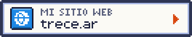</picture></a>
  <a href="https://linkedin.com/in/gushh" target="_blank"><picture><source media="(prefers-color-scheme: dark)" srcset="assets/btn-linkedin-dark.svg"></picture></a>
  <a href="mailto:gus@trece.ar"><picture><source media="(prefers-color-scheme: dark)" srcset="assets/btn-email-dark.svg"></picture></a>
  <a href="https://calendly.com/gushhio/30min" target="_blank"><picture><source media="(prefers-color-scheme: dark)" srcset="assets/btn-calendly-dark.svg"></picture></a>

 

<picture>
  <source media="(prefers-color-scheme: dark)" srcset="assets/title-sobre-mi-dark.svg">
  
</picture>

<picture>
  <source media="(prefers-color-scheme: dark)" srcset="assets/profile-dark.svg">
  
</picture>

Soy un **Desarrollador PHP especializado en Laravel** con más de 10 años de trayectoria construyendo software escalable y robusto. Mi carrera se ha centrado en el diseño de arquitecturas de sistemas, el liderazgo técnico de equipos y la optimización del rendimiento.

Me apasiona resolver problemas complejos y aplicar las mejores prácticas de desarrollo para crear soluciones eficientes y de alta calidad para clientes en toda Latinoamérica.

<table>
  <tr>
    <td align="center" width="33%" valign="top">
       
      <b>HABILIDAD PASIVA</b> 
      Especialista en arquitecturas de software robustas y escalables.
    </td>
    <td align="center" width="33%" valign="top">
      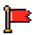 
      <b>HABILIDAD PASIVA</b> 
      Líder técnico con experiencia en la mentoría de equipos multidisciplinarios.
    </td>
    <td align="center" width="33%" valign="top">
      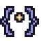 
      <b>HABILIDAD PASIVA</b> 
      Fiel creyente del código limpio (Clean Code) y las buenas prácticas de desarrollo.
    </td>
  </tr>
</table>

 

<picture>
  <source media="(prefers-color-scheme: dark)" srcset="assets/title-stack-dark.svg">
  
</picture>

<picture>
  <source media="(prefers-color-scheme: dark)" srcset="assets/inventory-dark.svg">
  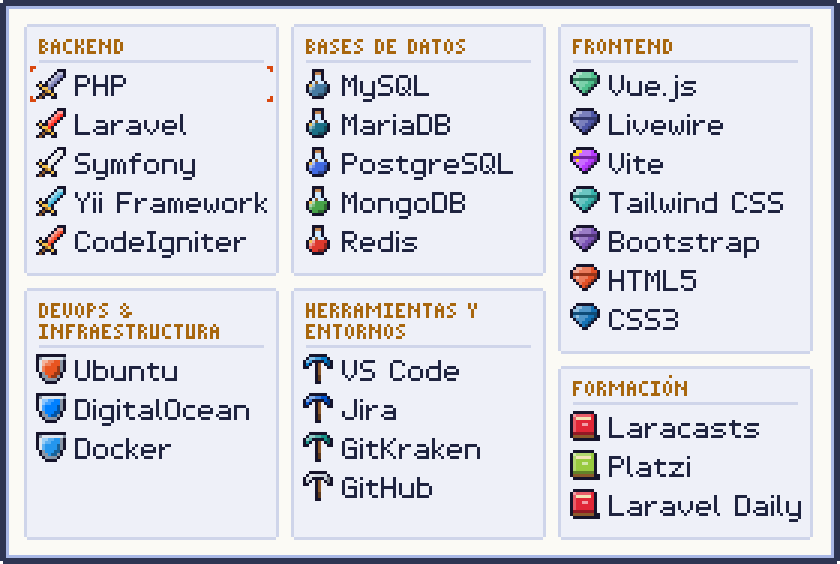
</picture>

  
<b>📜 Ver el inventario como texto</b>

   

| Categoría | Ítems |
| :-- | :-- |
| ⚔️ **Backend** | PHP · Laravel · Symfony · Yii Framework · CodeIgniter |
| 🧪 **Bases de Datos** | MySQL · MariaDB · PostgreSQL · MongoDB · Redis |
| 💎 **Frontend** | Vue.js · Livewire · Vite · Tailwind CSS · Bootstrap · HTML5 · CSS3 |
| 🛡️ **DevOps & Infraestructura** | Ubuntu · DigitalOcean · Docker |
| ⛏️ **Herramientas y Entornos** | VS Code · Jira · GitKraken · GitHub |
| 📚 **Formación** | Laracasts · Platzi · Laravel Daily |

 

<picture>
  <source media="(prefers-color-scheme: dark)" srcset="assets/title-experiencia-dark.svg">
  
</picture>

<picture>
  <source media="(prefers-color-scheme: dark)" srcset="assets/logro-liderazgo-dark.svg">
  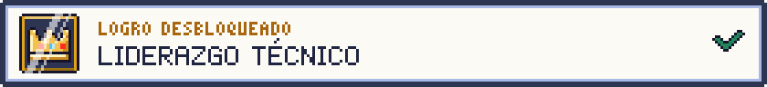
</picture>

> Lideré equipos de desarrollo backend, implementando metodologías de trabajo estructuradas con *pull requests*, *code reviews* y buenas prácticas en Laravel.

<picture>
  <source media="(prefers-color-scheme: dark)" srcset="assets/logro-arquitectura-dark.svg">
  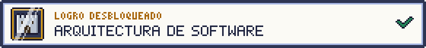
</picture>

> Diseñé la arquitectura y migración completa del portal de *Clasificados La Voz de Córdoba* (de Drupal a Laravel). Implementé arquitecturas basadas en DDD con Laravel y Doctrine para plataformas fintech.

<picture>
  <source media="(prefers-color-scheme: dark)" srcset="assets/logro-impacto-dark.svg">
  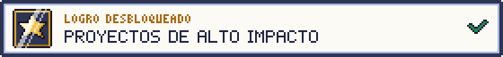
</picture>

> Desarrollé soluciones PHP en Symfony para clientes de gran escala como **PayPal, Bimbo, Virgin y Renault**.

 

<a href="https://calendly.com/gushhio/30min" target="_blank"><picture><source media="(prefers-color-scheme: dark)" srcset="assets/footer-dark.svg"></picture></a>
